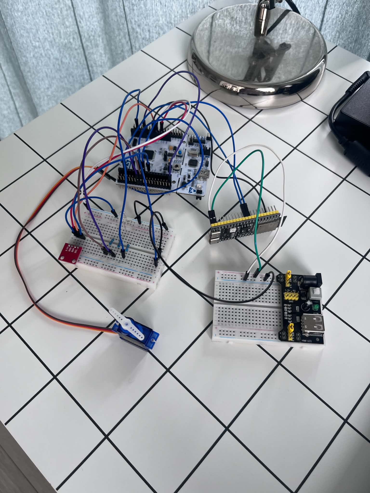
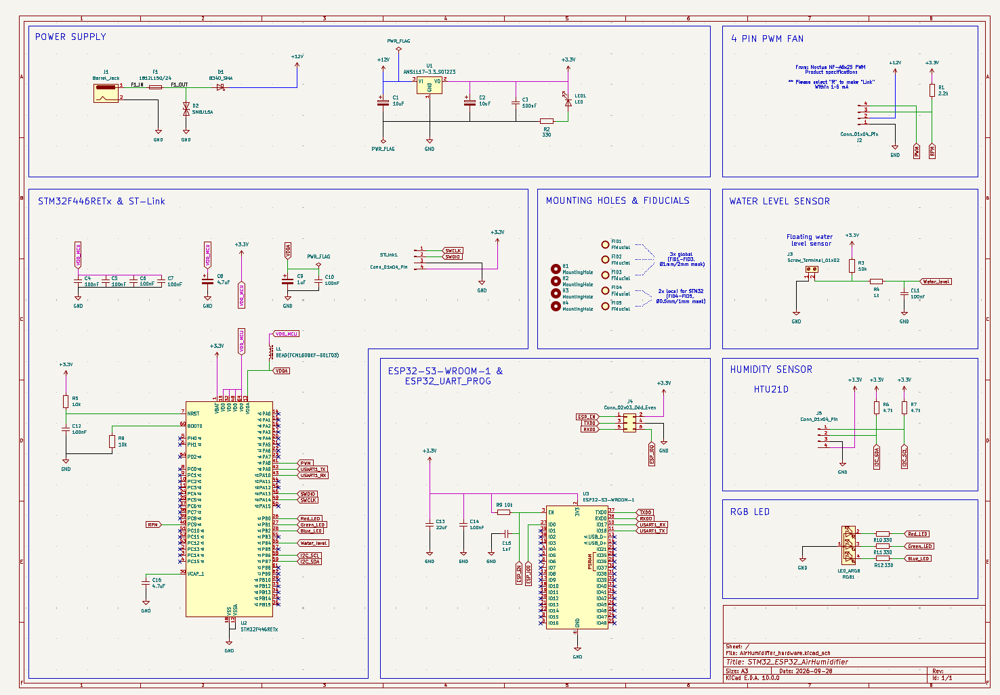
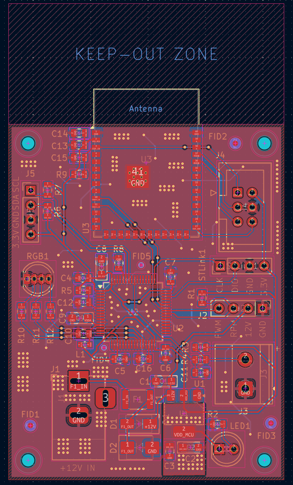
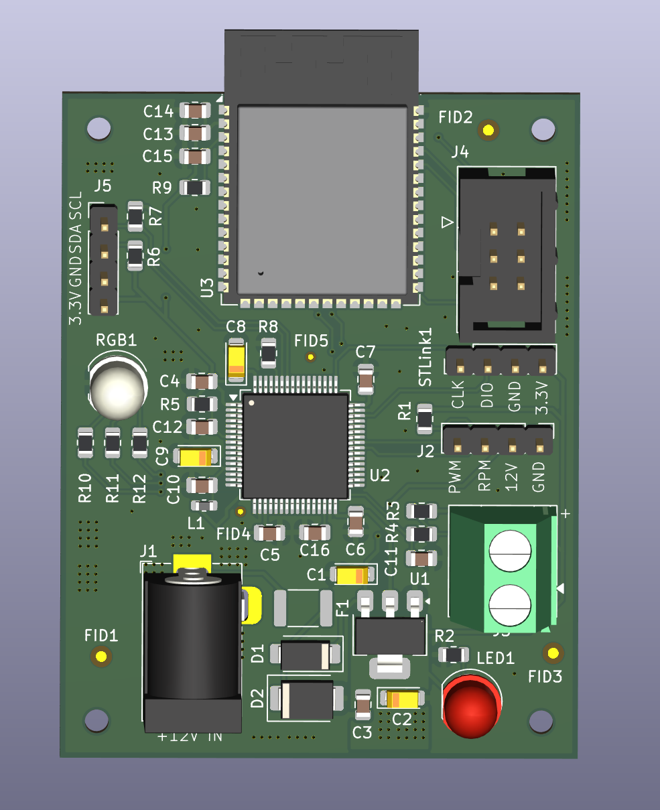
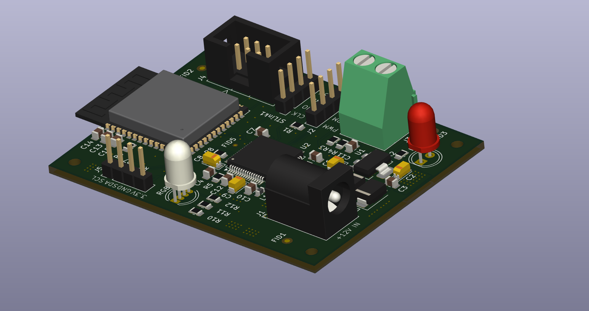

# STM32 + ESP32 IoT (AWS Core) Air Humidifier

Projekt zakładał stworzenie sterownika nawilżacza powietrza opartego na dwóch mikrokontrolerach STM32F446RE oraz ESP32-S3. STM32 odpowiada za sterowanie wentylatorem sygnałem PWM, obsługę czujników oraz maszynę stanów, na której opiera się działanie systemu. ESP32 służy wyłącznie do połączenia urządzenia z Wi-Fi, a następnie chmurą AWS IoT Core (Amazon) poprzez protokół MQTT.

Oba mikrokontrolery komunikują się ze sobą przez UART, wymieniając wiadomości w formacie JSON. STM32 wysyła do ESP32 informacje o aktualnej wilgotności, stanie systemu, prędkości obrotowej wentylatora oraz progu wilgotności ustawionym przez użytkownika. ESP32 przekazuje do STM32 wiadomość JSON przygotowaną wcześniej przez użytkownika, zawierającą żądany próg wilgotności w pomieszczeniu (np. 60%) oraz żądaną prędkość wentylatora, wybieraną poziomami od 0 do 5. Każdy poziom odpowiada innemu wypełnieniu sygnału PWM.

Firmware na STM32 jest napisany w C++, natomiast ESP32 działa na FreeRTOS, który jest natywną częścią frameworka.

Projekt był testowany na płytce stykowej, bez rzeczywistego wentylatora. Pomiar prędkości obrotowej sprawdzałem za pomocą drugiego timera, który generował impulsy i był fizycznie połączony z wejściem timera zliczającego impulsy z wentylatora. Sterowanie wentylatorem testowałem na servo ze zmienionymi parametrami sygnału PWM, ale logika sterowania pozostała taka sama.

This is an air humidifier controller built around two microcontrollers: an STM32F446RE and an ESP32-S3. The STM32 does the actual work. It drives the fan with PWM, reads the sensors and runs the state machine the whole system is based on. The ESP32 has only one job: it connects to Wi-Fi and talks to AWS IoT Core over MQTT.

The two chips talk to each other over UART using JSON messages. The STM32 sends the current humidity, system state, fan RPM and the humidity target set by the user. The ESP32 sends back a JSON message from the user with the target room humidity (e.g. 60%) and the fan speed level, from 0 to 5. Each level is a different PWM duty cycle.

The STM32 firmware is written in C++. The ESP32 runs on FreeRTOS, which comes built into ESP-IDF.

I tested everything on a breadboard without a real fan. To check the RPM measurement, I used a second timer to generate pulses and wired it to the input of the timer that counts the fan pulses. For fan control I used a servo instead, with different PWM settings, but the control logic stayed the same.

## Photos

**Breadboard prototype**

  

**Schematic**

  

**PCB layout and 3D render**

  
  &nbsp;
  

  

## How it works

The system has four states: **Waiting**, **Running**, **EmptyContainer** (no water in the tank) and **Error**.

In the main loop the STM32:

1. checks for a JSON command from the ESP32 (`{"hum": 55, "rpm_lvl": 3}`) and updates the target humidity and fan speed level,
2. reads humidity from the HTU21D every 1 s. After 3 failed reads in a row it resets the I2C bus and goes into Error,
3. reads the water level sensor (float switch),
4. sets the state. Priority: sensor fault, then empty tank, then humidity below target,
5. drives the fan (PWM) and the RGB LED (green: running, blue: empty tank, red: error),
6. every 10 s sends a status message to the ESP32, for example `{"CurrentHumidity":48.20,"SetHum":70.00,"Status":1,"RPM":2000}`.

Fan speed has 6 levels (0 to 5, which means 0 to 100% PWM). The real RPM is measured from the fan's tachometer output using timer input capture. The watchdog (IWDG) resets the MCU if the program hangs.

The ESP32 passes messages between UART (115200 baud) and MQTT (TLS):

- publishes to `humidifier/<client_id>/data`
- subscribes to `humidifier/<client_id>/cmd` (only valid JSON is sent on to the STM32)

## Peripherals / electronics

- **STM32F446RETx**: main microcontroller
- **ESP32-S3-WROOM-1**: Wi-Fi / MQTT module
- **HTU21D**: humidity sensor (I2C)
- **4-pin PWM fan** (PC fan, e.g. Noctua NF-A6x25 PWM): 12 V, PWM and tachometer
- **Water level sensor** (float switch)
- **RGB LED**: shows the system state
- **AMS1117-3.3**: 3.3 V voltage regulator
- 12 V power connector (barrel jack) with a fuse, reverse polarity diode and TVS overvoltage protection
- SWD connector (ST-Link) for the STM32 and UART/boot header for programming the ESP32

## BOM (short version)

| Reference        | Component                                             | Qty |
| ---------------- | ----------------------------------------------------- | --- |
| U2               | STM32F446RETx                                         | 1   |
| U3               | ESP32-S3-WROOM-1                                      | 1   |
| U1               | AMS1117-3.3 (3.3 V regulator)                         | 1   |
| RGB1             | RGB LED                                               | 1   |
| LED1             | LED (power indicator)                                 | 1   |
| J1               | Power jack (barrel jack)                              | 1   |
| J2               | 4-pin PWM fan connector                               | 1   |
| J3               | Screw terminal (water level sensor)                   | 1   |
| J4               | ESP32 programming header                              | 1   |
| J5               | HTU21D connector                                      | 1   |
| STLink1          | STM32 programmer connector                            | 1   |
| F1               | Fuse                                                  | 1   |
| D1               | Schottky diode B340 (reverse polarity protection)     | 1   |
| D2               | TVS diode SMBJ15A (overvoltage protection)            | 1   |
| L1               | Ferrite bead (power filtering)                        | 1   |
| R, C             | Resistors and capacitors (filtering, pull-up/down)    | ~28 |

The full list (with LCSC part numbers) is in `AirHumidifier/hardware/BOM.xlsx` and `All_BOM.csv`.

## Firmware

**STM32**: written in **C++** on top of the C code generated by STM32CubeMX/HAL. The humidifier state logic, humidity sensor, UART, JSON parser and I2C bus recovery are separate classes/modules. The rest (GPIO, I2C, timers, UART, watchdog) is generated HAL code.

**ESP32**: written in **C** with ESP-IDF (FreeRTOS), split into `WIFI`, `UART` and `MQTT` modules. To build it you have to add your own `main/secrets.h` (Wi-Fi credentials, AWS endpoint and client ID) and AWS IoT certificates in `main/Cert/`. They are not included in the repo.

## Repo structure

- `AirHumidifier/firmware/stm32/`: CMake project with the STM32 sources
- `AirHumidifier/firmware/esp32/`: ESP-IDF project for the ESP32
- `AirHumidifier/hardware/`: KiCad schematic and PCB, production files (Gerbers), BOM
- `AirHumidifier/hardware/Images/`: schematic and PCB renders
